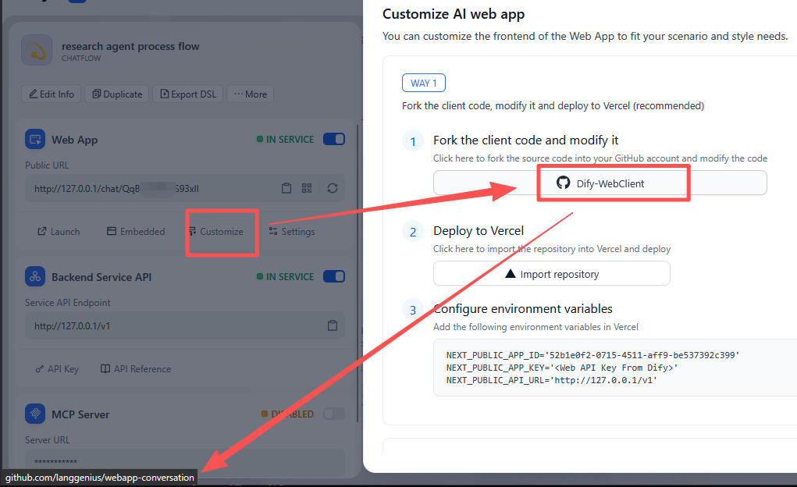

[English](README.md) | [中文](README_zh.md)

# Implement RBAC (Role based access control) for Dify

RBAC behavior: As shown on the left in the image below, when **admin** logs in they can see all apps, while **user** can only see the apps configured for their role (configured in [rbac.json](./rbac.json)).


# Software Architecture

This project is forked from the Dify official project (MIT license): [`langgenius/webapp-conversation`](https://github.com/langgenius/webapp-conversation) (Next.js)

For the RBAC implementation flow, see: [rbac_flow_guide](readme/rbac_flow_guide.md)

You can compare the `backup/webapp-conversation_original_code_202606` and `main` branches to see what code changes this project made to the original project.

# Config App

## Original [`langgenius/webapp-conversation`](https://github.com/langgenius/webapp-conversation) Config

Create a file named `.env.local` in the current directory and copy the contents from `.env.example`. Setting the following content:

```dotenv
# APP URL: This is the API's base URL.
NEXT_PUBLIC_API_URL=http://127.0.0.1/v1

# Multi-app configuration for RBAC. 
# The appId is the unique identifier from the Dify app URL.
# The apiKey is generated from the app's API Access page.
NEXT_PUBLIC_AGENT_CONFIGS=[{"id":"agent-1","name":"Agent 1","appId":"your-first-app-id","apiKey":"app-your-first-key"},{"id":"agent-2","name":"Agent 2","appId":"your-second-app-id","apiKey":"app-your-second-key"}]

# Used to sign the JWT Token for login.
JWT_SECRET=replace-this-in-production
```
- The `appId` and `apiKey` are from the Dify backend after you create an APP:

- [`langgenius/webapp-conversation`](https://github.com/langgenius/webapp-conversation) is the project that Dify provided for developers to folk and customize the web APP

Config more in `config/index.ts` file:

```js
export const APP_INFO: AppInfo = {
  title: 'Chat APP',
  description: '',
  copyright: '',
  privacy_policy: '',
  default_language: 'zh-Hans'
}

export const isShowPrompt = true
export const promptTemplate = ''
```

## RBAC Config

Edit [rbac.json](./rbac.json) directly to manage roles and accounts. The backend reloads this file at request time.

```json
{
  "defaultPassword": "123456",
  "roles": {
    "admin": {
      "agents": ["agent-1", "agent-2"]
    },
    "user": {
      "agents": ["agent-1"]
    }
  },
  "users": [
    { "username": "admin", "role": "admin" },
    { "username": "user", "role": "user" }
  ]
}
```

RBAC Notes:

- `roles.<role>.agents` (e.g. `"agent-1"`, `"agent-2"`) are `id` defined in `NEXT_PUBLIC_AGENT_CONFIGS`

Login Notes:

- `defaultPassword` is the shared password for every configured account.
- The default accounts are `admin / 123456` and `user / 123456`.

# Getting Started

First, install dependencies:

```bash
npm install
# or
yarn
# or
pnpm install
```

Then, run the development server:

```bash
npm run dev
# or
yarn dev
# or
pnpm dev
```

Open [http://localhost:3000](http://localhost:3000) with your browser to see the result.

# Open Source

This project is based on the MIT license of [`langgenius/webapp-conversation`](https://github.com/langgenius/webapp-conversation). This is an independent, community-maintained project, not an official Dify Project. It is not affiliated with, endorsed by, or sponsored by LangGenius / the Dify project.   
Please note that this project was rapidly developed using Vibe Coding and is not yet production-ready. My hope is that it serves as a springboard for further innovation. Developers with interest are welcome to optimize the project. [Discussion](https://github.com/codeHui/rbac-for-dify/discussions), bug fixes, and pull requests are all welcome!