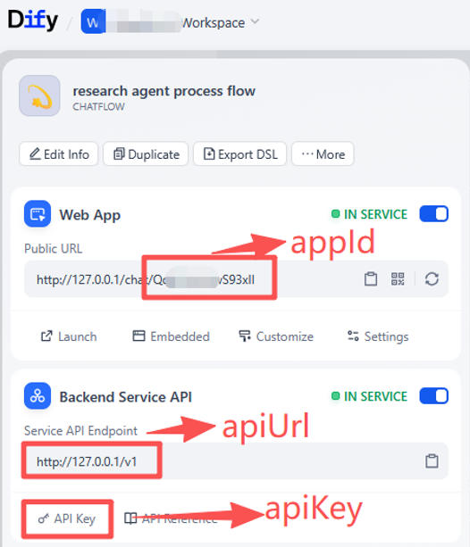

[English](README.md) | [中文](README_zh.md)

# Dify 的基于角色的访问控制 (RBAC)

**RBAC 行为：** 如下图左侧所示，当 **admin**（管理员）登录时，他们可以看到所有应用；而 **user**（普通用户）只能看到为其角色配置的应用（配置位于 [rbac.json](./rbac.json) 中）。  


# 软件架构

本项目源自 Dify 官方项目：[`langgenius/webapp-conversation`](https://github.com/langgenius/webapp-conversation)（这是一个基于 [`create-next-app`](https://github.com/vercel/next.js/tree/canary/packages/create-next-app) 脚手架搭建的 [Next.js](https%%3A//nextjs.org/) 项目）。

有关 RBAC 的具体实现流程，请参阅：[rbac_flow_guide](readme/rbac_flow_guide_cn.md)

你可以对比 `backup/webapp-conversation_original_code_202606` 分支和 `main` 分支，查看本项目对原始代码所做的具体修改。

# 应用配置

## 原始项目 [`langgenius/webapp-conversation`](https://github.com/langgenius/webapp-conversation) 配置

在当前目录下创建一个名为 `.env.local` 的文件，并从 `.env.example` 复制内容。设置以下内容：

```dotenv
# 应用地址：这是 API 的基础 URL。
NEXT_PUBLIC_API_URL=http://127.0.0.1/v1

# 用于 RBAC 的多应用配置。
# appId 是 Dify 应用 URL 中的唯一标识符。
# apiKey 是在应用的 API 访问页面中生成的。
NEXT_PUBLIC_AGENT_CONFIGS=[{"id":"agent-1","name":"Agent 1","appId":"your-first-app-id","apiKey":"app-your-first-key"},{"id":"agent-2","name":"Agent 2","appId":"your-second-app-id","apiKey":"app-your-second-key"}]

# 用于登录时签名 JWT Token。
JWT_SECRET=replace-this-in-production
```
`appId` 和 `apiKey` 来自你在 Dify 后台创建应用后的配置信息：  


你也可以在 `config/index.ts` 文件中进行更多配置：

```js
export const APP_INFO: AppInfo = {
  title: 'Chat APP',
  description: '',
  copyright: '',
  privacy_policy: '',
  default_language: 'zh-Hans'
}

export const isShowPrompt = true
export const promptTemplate = ''
```

## RBAC 配置

直接编辑 [rbac.json](./rbac.json) 文件即可管理角色和账户。后端会在每次请求时重新加载此文件。

```json
{
  "defaultPassword": "123456",
  "roles": {
    "admin": {
      "agents": ["agent-1", "agent-2"]
    },
    "user": {
      "agents": ["agent-1"]
    }
  },
  "users": [
    { "username": "admin", "role": "admin" },
    { "username": "user", "role": "user" }
  ]
}
```

RBAC 注意事项：

- `roles.<role>.agents`（例如 `"agent-1"`, `"agent-2"`）对应 `NEXT_PUBLIC_AGENT_CONFIGS` 中定义的 `id`。

登录注意事项：

- `defaultPassword` 是所有配置账户的共享密码。
- 默认账户为 `admin / 123456` 和 `user / 123456`。

# 快速开始

首先，安装依赖：

```bash
npm install
# 或者
yarn
# 或者
pnpm install
```

然后，运行开发服务器：

```bash
npm run dev
# 或者
yarn dev
# 或者
pnpm dev
```

用浏览器打开 [http://localhost:3000](http://localhost:3000) 即可查看效果。

# 开源

本项目基于 [`langgenius/webapp-conversation`](https://github.com/langgenius/webapp-conversation) 的 MIT 许可证发布。
请注意，本项目是使用 Vibe Coding 快速开发的，尚未达到生产就绪状态。希望它能作为一个跳板，激发更多的创新。感兴趣的开发者欢迎对其进行优化。[Discussion](https://github.com/codeHui/rbac-for-dify/discussions), bug fixes, 和 pull requests 都非常欢迎！